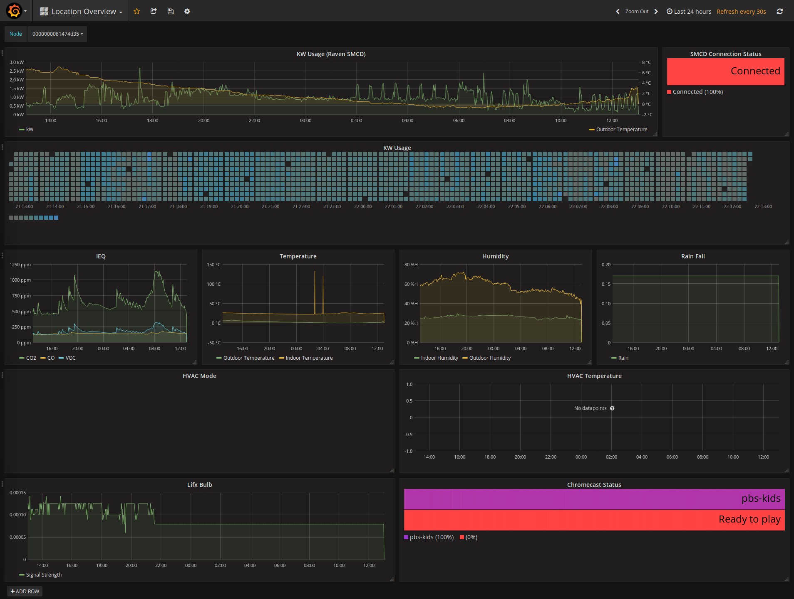
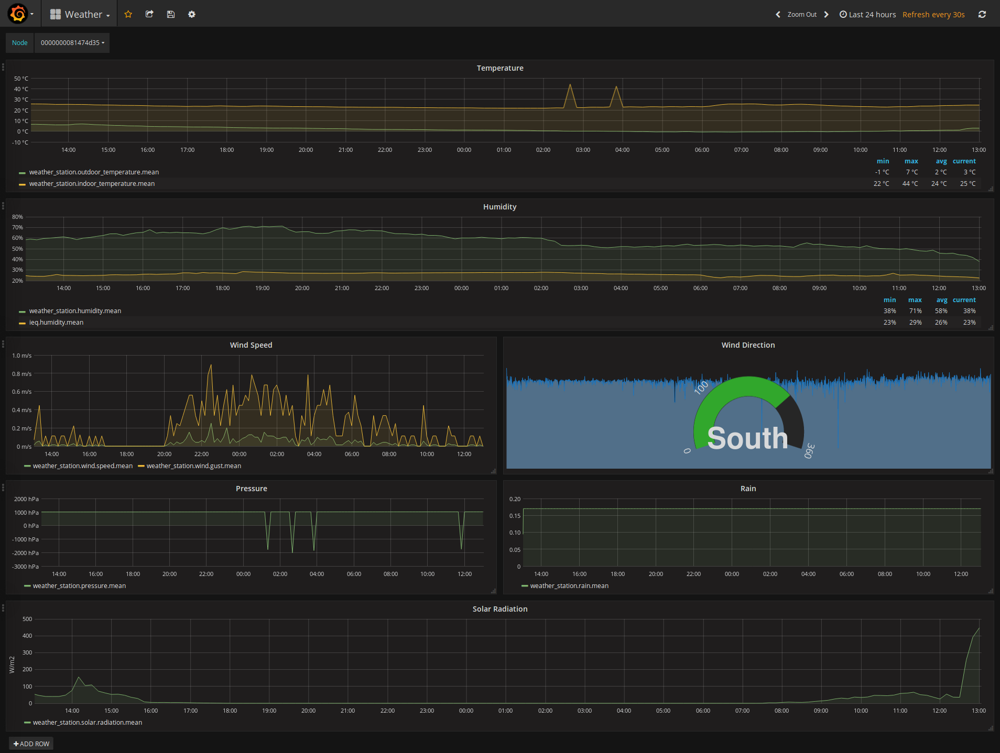

# Brood

Brood uses Docker for infrastructure management. To use this repository, make sure you have [Docker installed](https://docs.docker.com/engine/installation/) on your target machine.

Brood consists of the following software
* VerneMQ - MQTT
* InfluxDB - Timeseries database
* Grafana - Timeseries visualization
* Brood - Middleware

Brood forces an encrypted MQTT connection. The following steps show how to create self-signed certificates to get [RosettaHome](https://github.com/rosetta-home/rosetta_home) talking to Brood.

1. `$ cd priv`
2. `$ ../script/generate_ca.sh`
3. make sure to fill in the questions
4. copy the generated certificate .crt file to `priv/ssl/ca.crt`
5. `$ ../script/generate_server_crt.sh`
6. copy the generate key and certificate to `priv/ssl/brood.crt` and `priv/ssl/brood.key` respectively
7. `$ ../script/generate_client_crt.sh`
8. copy the generated key and certificate to RosettaHome's `rosetta_home/app/cloud_logger/priv/ssl/cicada.key` and `rosetta_home/app/cloud_logger/priv/ssl/cicada.crt`
  * you will have to manually build and burn a new [Rosetta Home image](https://github.com/rosetta-home/rosetta_home/blob/master/INSTALL.md).
9. `$ docker-compose up`
10. All logging is directed to `syslog`
11. Go to `http://localhost:3000`
12. Login:
  * un: admin
  * pw: admin
13. Setup data source
  * Main Menu > Data Sources > Add data Source
      * Name: Brood InfluxDB
      * Default: true/check
      * Type: InfluxDB
      * URL: http://influxdb:8086
      * Access: Proxy
      * Database: brood
14. Import pre-configured dashboards
  * Dashboard Menu > import
  * preconfigured dashboards are available in `brood/priv/dashboards`
  * Select InfluxDB data source configured above.

*unfortunately Grafana does not allow for auto-selecting datasources when automatically importing dashboards, so it's manual for now*

## Example Dashboard

#### Location Overview

#### Weather

